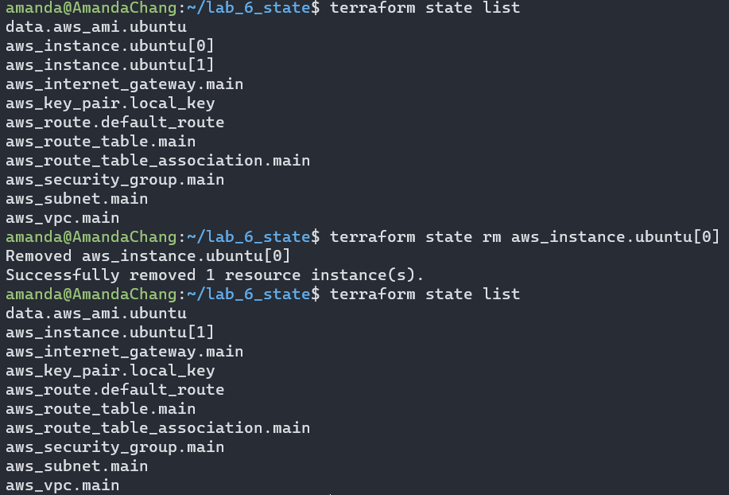

# ACIT 4640 - Lab 6 

* Amanda Chang 

## State Exercise 

**Using the starter Terraform configuration provided below.**

1. Download the provided starter code and create a new directory in WSL.
2. Navigate to the directory with the starter code using cd.
3. Run the following Terraform commands:
    * `terraform init`
    * `terraform validate`
    * `terraform plan`
    * `terraform apply`


**Remove one of the EC2 instances with the `state rm` command.**
```sh
# Check the list of resources tracked by Terraform in the current state
terraform state list 

# Remove 1 of the EC2 instances 
terraform state rm aws_instance.ubuntu[0]
```


**After removing the EC2 instance try to destroy the rest of your infrastructure. What problems did you encounter?**
* The EC2 instance that has been removed from the resource list cannot be deleted, along with any associated resources.
* The remaining EC2 instance in the resource list can be deleted using the `terraform destroy` command.


* Create an import block in `main.tf` to re-add both EC2 instances to the resource list. Execute the `terraform apply` command. 


**After identifying the problem destroy your infrastructure.**

**Comment out the "aws_instance" resource in `main.tf` file and recreate your infrastructure with a new `terraform apply`.**
**When your infrastructure has been provisioned add a new EC2 instance with the AWS CLI. Get the values needed for this command using terraform commands. The `terraform console` command might be a good option.**


* Execute `terraform apply`


```sh
# Add a new EC2 instance by executing the following command in CLI 
# Replace <> with corresponding info found after the terraform apply command 

aws ec2 run-instances \
--image-id <ami_id> \
--count 1 \
--instance-type <instance_type> \
--subnet-id <subnet_id> \
--security-group-ids <security_group_id> \
--key-name <key_name>
```


```sh
# Add tags (replace i-0... with your "InstanceId" value)

aws ec2 create-tags \
    --resources <instance_id> \
    --tags Key=Name,Value=ubuntu-server
```


**When your new EC2 instance has been created use an import block in the `main.tf` file to import this EC2 instance into your Terraform configuration.**

* Create a resource block and an import block in `main.tf` to add the EC2 instance to the resource list. Execute the `terraform apply` command. 


